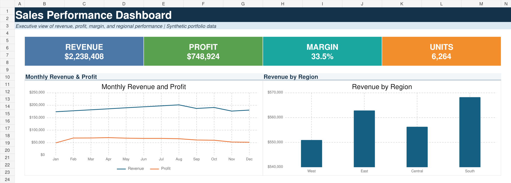
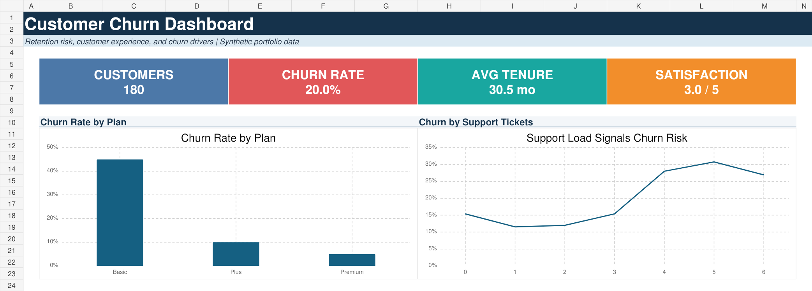
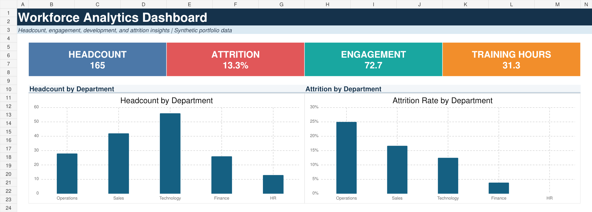

# BI Dashboard Portfolio

Business intelligence portfolio demonstrating Excel dashboard design, SQL analysis, KPI development, data modeling, and executive storytelling.

## Projects

### 1. Sales Performance Dashboard

Analyzes revenue, profit, margin, units, monthly performance, and regional results.

### 2. Customer Churn Dashboard

Identifies retention risk by plan, tenure, satisfaction, and support activity.

### 3. Workforce Analytics Dashboard

Summarizes headcount, engagement, training, performance, and attrition.

## Skills demonstrated

- Excel dashboards and native charts
- Formula-driven KPI calculations
- SQL aggregation and segmentation
- Data quality and KPI documentation
- Executive reporting and business storytelling

## Repository structure

Each project contains:

- An Excel workbook with Dashboard, Data, and KPI Definitions sheets
- A high-resolution dashboard preview
- A synthetic CSV dataset
- SQL analysis examples
- Project-specific documentation

> All datasets are synthetic and created solely for portfolio demonstration. They contain no proprietary, customer, or employee information.
