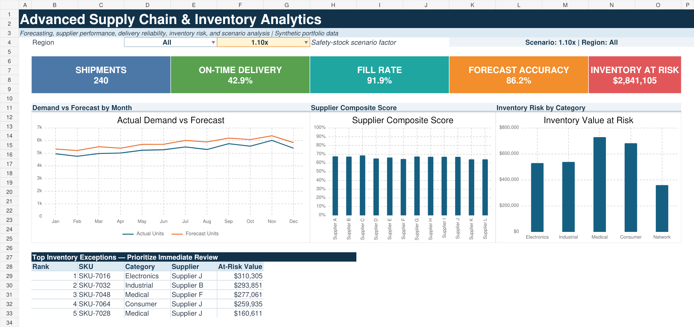
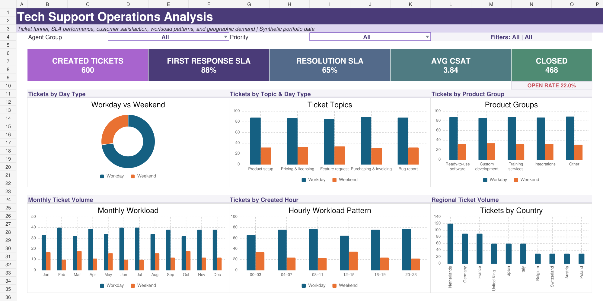
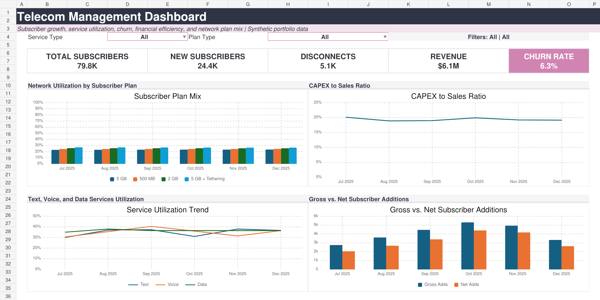

# BI Dashboard Portfolio

Business intelligence portfolio demonstrating Excel dashboard design, SQL analysis, KPI development, data modeling, scenario analysis, and executive storytelling.

## Projects

### 1. Sales Performance Dashboard

Analyzes revenue, profit, margin, units, monthly performance, and regional results.

### 2. Customer Churn Dashboard

Identifies retention risk by plan, tenure, satisfaction, and support activity.

### 3. Workforce Analytics Dashboard

Summarizes headcount, engagement, training, performance, and attrition.

### 4. Advanced Supply Chain & Inventory Analytics

Combines regional filtering, demand forecasting, supplier composite scoring, inventory-risk modeling, scenario-driven safety stock, and ranked operational exceptions.

### 5. Advanced Tech Support Operations Analysis

A reference-inspired support dashboard covering the ticket funnel, SLA attainment, CSAT, day type, issue topics, product groups, hourly patterns, and regional workload.

### 6. Telecom Management Dashboard

Tracks subscriber growth, churn, service utilization, plan mix, CAPEX efficiency, revenue, and gross-versus-net additions through an executive telecom scorecard.

## Skills demonstrated

- Advanced Excel dashboards and native charts
- Formula-driven KPI calculations and scenario analysis
- SQL aggregation, segmentation, and exception reporting
- Multi-table data modeling and forecast analysis
- Telecom, supplier, inventory, workforce, customer, and service analytics
- Data quality and KPI documentation
- Executive reporting and business storytelling

## Repository structure

Each project contains:

- An Excel workbook with dashboard, source-data, analysis, and KPI-definition sheets
- A high-resolution dashboard preview
- Synthetic CSV datasets
- SQL analysis examples
- Project-specific documentation

> All datasets are synthetic and created solely for portfolio demonstration. They contain no proprietary, customer, or employee information.
