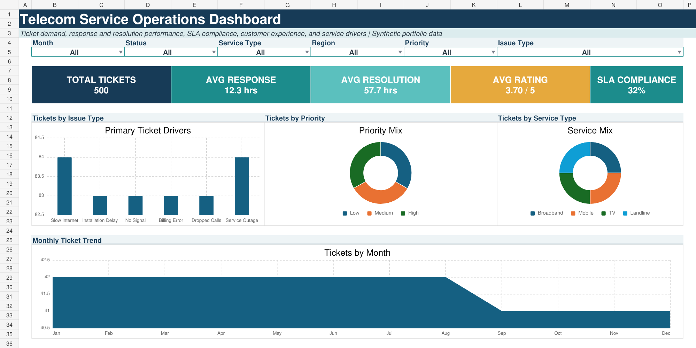

# Telecom Service Operations Dashboard

## Executive objective
Help telecom service leaders monitor ticket demand, response and resolution performance, SLA compliance, customer ratings, service mix, priority mix, and recurring issue drivers.

## Modifications from the reference
- Modern navy and teal executive color system instead of the original gold theme
- Streamlined top navigation without a large sidebar
- Added SLA-compliance KPI
- Clearer operational wording and simplified chart hierarchy

## Capabilities
- Six selector controls for month, status, service, region, priority, and issue type
- Formula-driven KPI cards
- Issue-driver ranking, priority mix, service mix, and monthly trend
- 500-row synthetic telecom support dataset
- SQL analysis and auditable KPI definitions

> The layout is inspired by the supplied visual reference. All data and calculations are original and synthetic.
